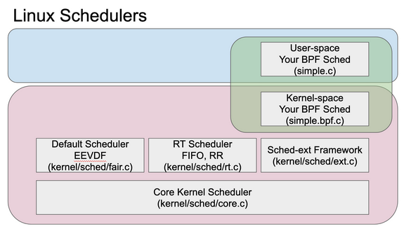

# II. Understanding Sched-Ext

## II.A. Understanding the Minimal Scheduler

The scheduler lives in the `sched_ext.bpf.c` file. The scheduler code only depends on the Linux bpf kernel headers and `sched_ext`.

We start with naming the custom-scheduler with the different operations that may be implemented by updating the __scheduler operations structure__ ( `sched_ops` ). As you might have guessed, the scheduler shall be named __"minimal_scheduler"__.

```
// This header is autogenerated, as explained later
#include "vmlinux.h"

// The following two headers come from the Linux headers library
#include <bpf/bpf_helpers.h>
#include <bpf/bpf_tracing.h>

....
```

```
....


// Define the main scheduler operations structure (sched_ops) 
SEC(".struct_ops.link") 

struct sched_ext_ops sched_ops = { 
.enqueue = (void *)sched_enqueue, 
.dispatch = (void *)sched_dispatch, 
.init = (void *)sched_init,

// There are more functions available, but we'll focus 
// on the important ones for a minimal scheduler 
.flags = SCX_OPS_ENQ_LAST | SCX_OPS_KEEP_BUILTIN_IDLE, 

// A name that will appear in 
// /sys/kernel/sched_ext/root/ops 
// after we attached the scheduler 
// The name has to be a valid C identifier 
.name = "minimal_scheduler" 
}; 

// All schedulers have to be GPLv2 licensed 
char _license[] SEC("license") = "GPL";
```

The initialization of the scheduler, the dispatch of tasks to the cpu and the enqueuing of tasks within the different queues within the system shall be handled by the `sched_init`, `sched_dispatch` and `sched_enqueue` methods respectively.

We shall initialize our custom-scheduler, to operate with a single globally shared dispatch-queue into which all the tasks to be scheduled shall be enqueued. We shall use the `scx_bpf_create_dsq` api call within the `sched_init` function as follows:

```
// Initialize the scheduler by creating a shared dispatch queue (DSQ)
s32 BPF_STRUCT_OPS_SLEEPABLE(sched_init) {
    // All scx_ functions come from vmlinux.h
    return scx_bpf_create_dsq(SHARED_DSQ_ID, -1);
}
```
We then proceed to define the enqueue operation, `sched_enqueue` in the following way:
```
// Enqueue a task to the shared DSQ that wants to run, 
// dispatching it with a time slice
int BPF_STRUCT_OPS(sched_enqueue, struct task_struct *p, u64 enq_flags) {
    // Calculate the time slice for the task based on the number of tasks in the queue
    // This makes the system slightly more responsive than a basic round-robin
    // scheduler, which assigns every task the same time slice all the time
    // The base time slice is 5_000_000ns or 5ms
    u64 slice = 5000000u / scx_bpf_dsq_nr_queued(SHARED_DSQ_ID);
    scx_bpf_dsq_insert(p, SHARED_DSQ_ID, slice, enq_flags);
    return 0;
}
```
Each task (identified by the `struct task_struct *p` ) is enqueued into the globally shared dispatch-queue by using the `scx_bpf_dsq_insert` api-call. Note that we need to pass a time-slice parameter ( `slice` ), that describes the time-interval allocated to each task within the Round-Robin scheduling policy. In the above scenario, we choose a **base time-slice of 5ms** and allocate a time-slice that is inversely proportional to the total number of enqueued tasks. Thus, if there was only one task to be scheduled, it is allocated a time-slice of 5ms, after which it gets de-allocated from the cpu and waits to be allocated again. In the scenario that there are `n` enqueued tasks within the shared-dispatch queue, then the current task is allocated a time-slice of  `5ms / n tasks`. We ensure that the shared dispatc-queue implements a FIFO-scheduling policy by setting the enqueue-flag to be `SCX_OPS_ENQ_LAST`.

Once the tasks have been enqueued into the shared dipatch-queue, we need to now define the `sched_dispatch` method, that dispatches a task onto any available CPU by using the `scx_bpf_dsq_move_to_local` api-method:

```
// Dispatch a task from the shared DSQ to a CPU,
// whenever a CPU needs something to run, usually after it is finished
// running the previous task for the allotted time slice
int BPF_STRUCT_OPS(sched_dispatch, s32 cpu, struct task_struct *prev) {
    scx_bpf_dsq_move_to_local(SHARED_DSQ_ID);
    return 0;
}
```


## II.B. Understanding Process Schedulers

Early in our semester, we have covered the topic of process schedulers and discussed how different scheduling policies perform with respect to variouos metrics of concern. Now, that you have executed a custom process scheduler, by using the `sched_ext` framework, we can dig a little under the hood, and examine how the Linux Operating System implements a process scheduler.

At a high-level of abstraction, a process scheduler is a resource allocation engine, that allocates a compute-resource ( cpu ) to a specific computational task (a process) for a certain duration of time. Thus, there are three questions to be addressed, when designing a process scheduler:


+ Which task should be run next? ( `Task Selection` )
+ How long should the chosen task be allowed to run? ( `Time-slice configuration` )
+ Which cpu-core should be used for executing the chosen task? ( `Computational-core selection` )

The Linux OS implements its process scheduler as a scheduler class, which can be instantiated differently to meet custom-requirements. The Linux OS-Process Scheduler design can be understood to have the following abstract components: (1) a `core kernel scheduler` and (2) default scheduler instantiations - (a) a `fair scheduler`; (b) `real-time scheduler`; for meeting the needs of general-purpose tasks and real-time constrained tasks respectively.





In this assignment, we shall learn about the extensible scheduler framework ( `sched_ext`) that's been designed using the BPF-technology stack to operate at the same level or priority as the default Linux Fair scheduler. This helps to ensure that in the scenario of a failure mode within the custom BPF-based scheduler, the Linux OS can switch seamlessly into the default fair scheduler. Note that when developing a custom user-space scheduler, that runs atop `sched_ext`, we need to develop the scheduler with two stages - one operating in the user space (eg. `simple.c` in above figure ) and a component that operates in the kernel space (eg. `simple.bpf.c` in above figure). While this diagram helps to understand the organization of the code that contributes to the development of the scheduler, it does not help us visualize the architecture of a process scheduler.

 based scheduler design")


The architecture of the process scheduler can be understood to comprise of a system of dispatch-queues (DSQs) that are responsible for selection of tasks based on a **first-in-first-out (FIFO)** scheduling policy, or a custom priority-based scheduling policy. Additionally, there are dispatch-queues that are local to each computing resource which operate as a FIFO-queues. The task of designing a process scheduler thus involves instantiating a system of dispatch-queues, and determining how tasks shall be selected and inserted into these queues.

The design of the `minimal_scheduler` in the above section, can be understood using the following visualization:


Note that there are 3 types of physical entities in this image -

1. Computational resource (`cpu hardware`)
2. Computational task ( `processes` )
3. Communication infrastructure / messaging queues ( `dispatch queues` )

The computational tasks are represented as a set of objects (eg. t0, t1, t2, t3, t4 ) that are transported across the system through the dispatch queues. The computational resources that are responsible for executing the tasks are also represented as a set of objects (eg. cpu-0, cpu-1, cpu-2). There are three types of dispatch queues permissible within the `sched_ext` framework:

1. global FIFO-queue ( default queue, `SCX_DSQ_GLOBAL` )
2. global Priority-queue ( custom BPF-queue , `SHARED_DSQ_ID` )
3. local FIFO-queues ( default for each computational resource, `SCX_DSQ_LOCAL` )

Tasks can be inserted into the global and local queues using the `scx_bpf_dsq_insert()` api-method, as witnessed within the `sched_enqueue` function. The tasks from the global/local queues are then dispatched into the local-FIFO queues associated with each computing resource (cpu) by using the `scx_bpf_move_to_local()` api-method, as witnessed within the `sched_dispatch` function. Thus, the simplest way of designing a custom process scheduler involves the following steps:


1. determine the time-slice configuration for each task
2. implementing a scheduling-policy by means of designing the priority-order for each global-shared queue or system of queues.


We have examined how to address the above steps in a simplified manner when we developed the implementation for the `minimal_scheduler` in the earlier section. We shall now proceed to something more challenging, to help you develop a more tangible understanding of using `sched_ext` for your custom needs.


If you feel that you would like to have a more detailed explanation of how a process scheduler is designed, and how you may utilize the `sched_ext` based extensible scheduler, we recommend that you review the following blog articles -

A. [sched_ext : a BPF-extensible scheduler class ( Part 1 )](https://blogs.igalia.com/changwoo/sched-ext-a-bpf-extensible-scheduler-class-part-1/)
B. [sched_ext : scheduler architecture and interfaces ( Part 2 )](https://blogs.igalia.com/changwoo/sched-ext-scheduler-architecture-and-interfaces-part-2/)

## II.C. Developing your own custom scheduler

Now that you know what a basic scheduler looks like, you can start modifying it. Here are a few suggestions:

### II.C.1 Custom ways to configure the time-slice
1. How does your system behave when you increase or decrease the time-slice quanta used in the allocated to each task within your scheduling policy?
2. What happens when you used a fixed time-slice duration, which is independent of the number of tasks that have been enqueued within the global dispatch-queues?

### II.C.2. Custom ways to select the CPUs
1. How does your system behave if the scheduler only schedules to a subset of the available CPUs?
2. Can you force your multi-core CPU architecture to behave as a single-core CPU architecture? 


### II.C.3. Custom ways to designing the system of dispatch queues
1. Design a scheduler that uses two priority queues, one that operates FIFO and another that operates LIFO. Assume that the even-numbered process-ids are allocated to the FIFO-queue, while the odd-numbered process-ids are allocated to the LIFO-queue.

You may explore further by using the resources provided in this [wiki page](https://github.com/sched-ext/scx/wiki).

### II.C.4. Custom schedulers provided in the Linux kernel archive

You may execute the schedulers that are provided with the Linux kernel source code by following the instructions below. The schedulers are provided within the `tools/sched_ext` folder

```
# Navigate into the directory for sched-ext
cd /home/kernel/linux-6.14.2/tools/sched_ext

# Configure the build process
sudo ln -s /usr/bin/ld.lld-18 /usr/bin/ld.lld
sudo make LLVM=1 CLANG=clang-18 LLC=llc-18
sudo make install
```

You may execute the compiled schedulers as follows:

```
$ cd /home/kernel/linux-6.14.2/tools/sched_ext/build/bin
$ sudo ./scx_simple
$ sudo ./scx_flatcg
$ sudo ./scx_qmap
$ sudo ./scx_central
```

Additionally, you can determine whether a sched-ext based scheduler is currently running or not, by using:

```
$ cat /sys/kernel/sched_ext/state /sys/kernel/sched_ext/*/ops 2>/dev/null
# enabled
```

## II.D. References
1. [Minimal Scheduler github-repo]( https://github.com/parttimenerd/minimal-scheduler )
2. [Sched-Ext/Scx github-repo](https://github.com/sched-ext/scx/wiki)
3. [FOSDEM25 - Sched-Ext github-repo](https://github.com/sched-ext/fosdem25)
4. [Sched-Ext : A BPF Extensible Scheduler Class Part-I](https://blogs.igalia.com/changwoo/sched-ext-a-bpf-extensible-scheduler-class-part-1)
5. [Sched-Ext: Scheduler Architecture and Interface Part-II](https://blogs.igalia.com/changwoo/sched-ext-scheduler-architecture-and-interfaces-part-2)
6. [SCX Simple Scheduler : User-space Implementation](https://eunomia.dev/en/tutorials/44-scx-simple/#user-space-implementation)


## II.E. Submission

We shall now re-iterate your submission requirements for PA7, to avoid any confusion. Please ensure that your submission includes the following:

+ A screenshot of your grub boot menu showing the new kernel as an option.
+ A screenshot of the output of `uname -a` command showing the new kernel version (`6.14.2-rev1`).
+ **We'll confirm that your Cloud VM boots, by default, into the -rev1 version of the kernel. Thus, you MUST boot into the new kernel version after compiling and installing successfully.**
+ A screenshot of the output of `sudo dmesg | tail` command showing that the `minimal_scheduler` had been enabled. (We shall look for the log message: `sched_ext: BPF scheduler "minimal_scheduler" enabled` )


