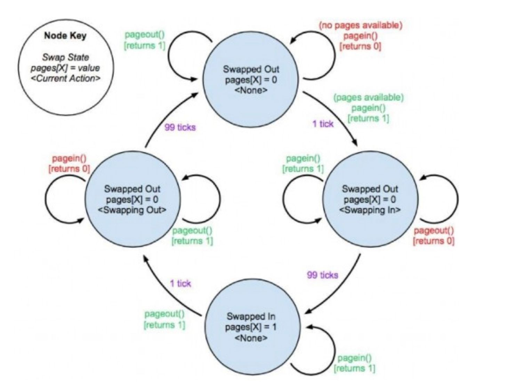
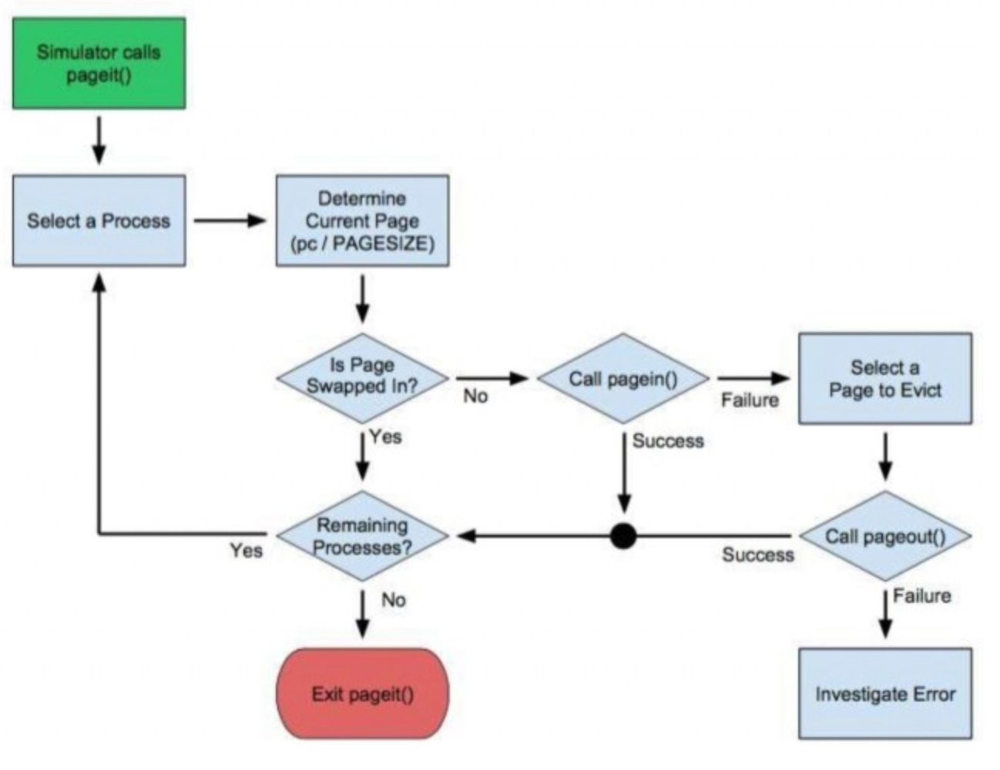

# Introduction

Modern operating systems use virtual memory and paging in order to effectively utilize the computer’s memory hierarchy.  Paging provides memory space protection to processes, enables the use of secondary storage, and also removes the need to allocate memory sequentially for each process.

We have studied how virtual memory systems are structured and how the MMU converts virtual memory addresses to physical memory addresses by means of a page table and a Translation Lookaside Buffer (TLB).  When a page has a valid mapping from a virtual memory address to a physical address, we say the page is swapped in.  When no valid mapping is available, the page is either invalid (a segmentation fault), or more likely, swapped out.

When the MMU determines that a memory request requires access to a page that is currently swapped out, it calls the operating system’s page-fault handler.  This handler must swap-in the necessary page, possibly evicting another page to secondary memory in the process.  It then retries the offending memory access and hands control back to the MMU.

As you might imagine, how the OS chooses which page to evict when it has reached the limit of available physical pages (sometimes called frames) can have a major effect on the performance of the memory access on a given system.  In this assignment, we will look at various strategies for managing the system page table and controlling when pages are paged in and when they are paged out.

---

## Your Task

The goal of this assignment is to implement a paging strategy that maximizes the performance of the memory access in a set of predefined programs.  You will accomplish this task by using a paging simulator that has been created for you.  Your job is to write the paging strategy that the simulator utilizes (roughly equivalent to the role the page fault handler plays in a real OS).

Your initial goal will be to create a Least Recently Used (LRU) paging implementation.  You will then implement a predictive paging algorithm for PA8, with the intent of increasing the performance of your paging policy.  You will be graded on the throughput of your solution (the ratio of time spent doing useful work vs time spent waiting on the necessary paging to occur).

---

## The Paging Simulator Environment

The paging simulator has been provided for you in `pa7.zip`.  You have access to the source code if you wish to review it (`simulator.c` and `simulator.h`), but you should not need to modify this code.  You will be graded using the unmodified simulator, so any enhancements to the simulator program made with the intention of improving your performance will be for naught.

The simulator runs a random set of programs utilizing a limited number of shared physical pages.  Each process has a fixed number of virtual pages (that compose the process’s virtual memory space) that it might try to access.  For the purpose of this simulation, all memory access is due to the need to load program code.

The simulated program counter (PC) for each process dictates which memory location that process currently requires access to, and thus which virtual page must be swapped-in for the process to successfully continue.

The values of the constants mentioned above are available in the `simulator.h` file.  For the purposes of grading your assignment, the default values will be used:

- 20 virtual pages per process (`MAXPROCPAGES`)
- 20 simultaneous processes competing for pages (`MAXPROCESSES`)
- 128 memory unit page size (`PAGESIZE`)
- 100 tick delay to swap a page in or out (`PAGEWAIT`)
- 100 physical pages (frames) total (`PHYSICALPAGES`)
- 40 processes run in total (`QUEUESIZE`)

As you can see, you are working in a very resource constrained environment.  You will have to deal with attempts to access up to 400 virtual pages (20 processes times 20 virtual pages per process), but may only have, at most, 100 physical pages swapped in at any given time.

In addition, swapping a page in or out is an expensive operation, requiring 100 ticks to complete.  A tick is the minimum time unit used in the simulator.  Each instruction or step in the simulated programs requires 1 tick to complete.  Thus, in the worst case where every instruction is a page miss (requiring a swap-in), you will spend 100 ticks of paging overhead for every 1 tick of useful work!  If all physical pages are in use, this turns into 200 ticks per page miss since you must also spend 100 ticks swapping a page out in order to make room for the required page to be swapped in.  This leads to an “overhead to useful work” ratio of 200 to 1, which is very, very, poor performance.  Your goal is to implement a system that does much better than this worst case scenario.

---

## The Simulator Interface

The simulator exports three functions which you will use to interact with it: `pageit()`, `pagein()` and `pageout()`.

The first function, `pageit()`, is the core paging function.  It is roughly equivalent to the page-fault handler in your operating system.  The simulator calls `pageit()` anytime something interesting happens (memory access, page fault, process completion, etc.) or basically every CPU cycle, which we'll refer to as a tick.  It passes the function a page map for each process, as well as the current value of the program counter for each process.  See `simulator.h` for details.  You will implement your paging strategy in the body of this function.

The `pageit()` function is passed an array of `pentry` structs, one per process.  This struct contains a copy of all of the necessary memory information that the simulator maintains for each process.  You will most likely need the information contained in this struct to make intelligent paging decisions.  You can read these fields as necessary, but you should not write to them, as any changes you make will be lost when you return from `pageit()`.  The struct contains:

- **long active**: A flag indicating whether or not the process has been completed.  1 running, 0 exited.
- **long pc**: The value of the program counter for the process.  The current page can be calculated as `page = pc / PAGESIZE`.
- **long npages**: The number of pages in the process's memory space.  If the process is active (running), this will be equal to `MAXPROCPAGES`.  If the process has exited, this will be 0.
- **long pages[MAXPROCPAGES]**: An array representing the page map for a given process.  If `pages[X]` is 0, page X is swapped out, swapping out, or swapping in.  If `pages[X]` is 1, page X is currently swapped in.

The simulator also exports the functions `pagein()` and `pageout()`, which are used to request that a specific page for a specific process be paged in or out.  You will use these functions to control the allocation of virtual and physical pages when writing your paging strategy.  Note that a page will be marked as swapped out as soon as the `pageout()` request is made, but is not recognized as swapped in until after the `pagein()` request completes 100 ticks later.

`pagein()` and `pageout()` will return a 1 if they succeed in starting a paging operation, if the requested paging operation is already in progress, or if the requested state already exists.  100 ticks after requesting a paging operation, the operation will complete.

These functions return 0 if the paging request cannot be processed (due to exceeding the limit of physical pages or because another paging operation is currently in process on the requested page) or if the request is invalid (paging operation requests non-existent page, etc).



Figure 1 shows the possible states that a virtual page can occupy, as well as the possible transitions between these states.  Note that the page map values alone do not define all possible page states.  We must also account for the possible operations currently underway on a page to fully define its state.  While the page map for each process can be obtained from the pageit() input array of structs, there is no interface to directly reveal any operations underway on a given page.  If knowing whether or not a paging operation is underway on a given page (and thus knowing the full state of a page) is necessary for your pageit() implementation, you must maintain this data yourself.


---

## The Simulated Programs

The simulator populates its 20 concurrent processes by randomly creating them from a collection of 5 types of simulated “programs”.  Pseudo code for each of the possible 5 programs is provided below:

### Program 1 - A loop with an inner branch

```
# loop with inner branch
for 10 30
  run 500
  if .4
    run 900
  else
    run 131
  endif
end
exit
```

### Program 2 - Single loop

```
# one loop
for 20 50
 run 1129
end
exit
```

### Program 3 - Double nested loop

```
# doubly-nested loop
for 10 20
  run 1166
  for 10 20
    run 516
  end
end
exit
```

### Program 4 - Linear

```
# entirely linear
run 1911
exit
```

### Program 5 - Probabilistic backward branch

```
# probabilistic backward branch
for 10 20
  label:
    run 500
    if .5
      goto label
    endif
end
exit
```

Note that while you know the structure of these programs, any program's flow is still probabilistic in nature.  Which branch a specific process takes, how many loop iterations occur, or how long sequential runs are will be dependent upon the random seed generated by the simulator.  Thus, you may never be able to perfectly predict the execution of a process, only the probabilistic likelihood of a collection of possible execution paths.

---

## Some Implementation Ideas

In general, your `pageit()` implementation will need to follow the basic flow presented in Figure 2.  You will probably spend most of your time deciding how to implement the “Select a Page to Evict” element.




A basic “one-process-at-a-time” implementation is provided for you.  This implementation never actually ends up having to swap out any pages.  Since only one process is allocated pages at a time, no more than 20 pages are ever in use.  When each process completes, it releases all of its pages and the next process is allowed to allocate pages and run.  This is a very simple solution, and as you might expect, does not provide very good performance.  Still, it provides a demonstration of the simulator API.  See `pager-basic.c` for more information.

To start, create some form of “Least Recently Used” (LRU) paging algorithm.  An LRU algorithm selects a page that has not been accessed for some time when it must swap a page out to make room for a new page to be swapped in.  An LRU algorithm can either operate globally across all processes, or locally to a given process.  In the latter case, you may wish to pre-reserve a number of physical pages for each process and only allow each process to compete for pages from this subset.  A stub for implementing an LRU version of `pageit()` has been created for you in the `pager-lru.c` file.  Note the use of static variables in order to preserve local state between calls to `pageit()`.  Your LRU algorithm should perform much better than the trivial solution provided by the `pager-basic.c` algorithm.

---

## What’s Included

We provide code in `pa7.zip` to get you started:

- `Makefile` : GNU Make makefile to build all the code listed here.
- `simulator.c` : Core simulator source code, for reference only.
- `simulator.h` : Simulator header file including the simulator API.
- `programs.c` : Struct representing simulated programs. For use by simulator code only.
- `pager-basic.c` : Basic paging implementation that only runs one process at a time.
- `pager-lru.c` : Skeleton for your PA7 LRU paging implementation.
- `see.R` : R script for displaying a visualization of the process run/block activity in a simulation.  You must first run `./test-* -csv` to generate the necessary trace files.  To run a visualization, launch R in windowed graphics mode (in Linux: `R -g Tk &` at the command prompt) from the directory containing the trace files (or use `setwd` to set your working directory to the directory containing the trace files).  Then run `source("see.R")` at the R command prompt to launch the visualization.

Run `./test-basic -help` for information on available options.  The simulator responds to ctrl-c by printing the current page table and process execution state to the screen.

---

## What You Must Submit

When you submit your assignment, you must provide the following:

- The `pager-lru.c` of your LRU paging implementation
- Any additional `.c` and `.h` files you might have created to support your pager implementations
- A 1 page report(.pdf) of things you learned, difficulties you encountered and how you overcame them, comments about the assignment, etc.

If the only file you modified is `pager-lru.c`, simply type `make submit` inside your working directory.  Enter your Identikey username when prompted, make will generate a `PA7-<username>.txt` file for submission to Canvas.

---

## Grading

Your code will be subjected to an automated grading script which will evaluate your paging algorithm as measured by the overhead to useful work ratio (blocked/compute cycles):

```
ratio >= 5.12: 0 Points
2.56 <= ratio < 5.12: 10 Points
1.28 <= ratio < 2.56: 20 Points
0.64 <= ratio < 1.28: 30 Points
0.32 <= ratio < 0.64: 40 Points
0.00 <= ratio < 0.32: 50 Points
```

We will run your code using several random seeds and will use the average of these runs as your score.  Thus, if your program’s performance varies widely from run-to-run, you may get bitten by our automated grader.

