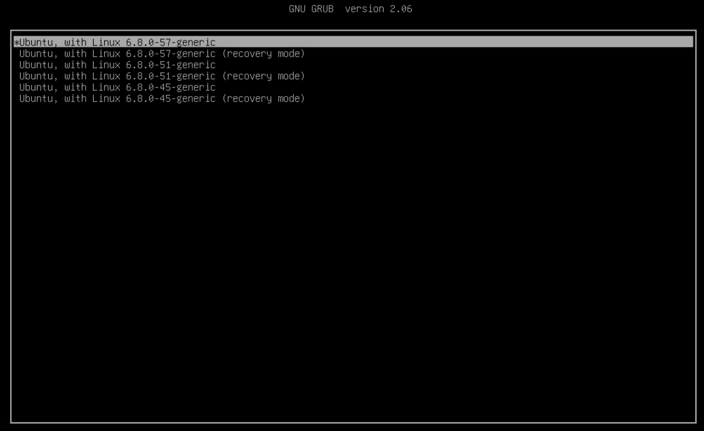
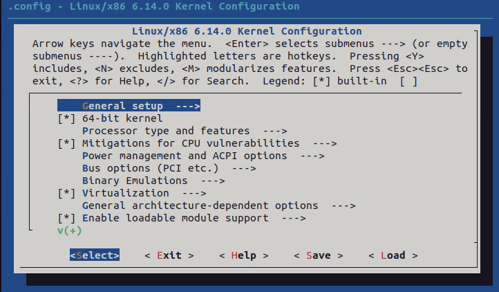
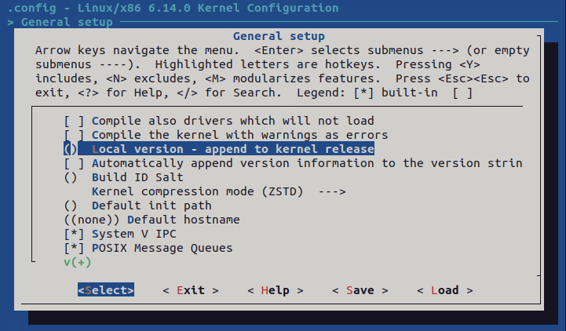

# PA0: Compile and Install a New Kernel

## Introduction 

Welcome to the first programming assignment for CSCI 3753 - Operating Systems.  
In this assignment we will go over how to compile and install the Linux kernel. 
The latest Linux kernel source can be found at [kernel.org](https://www.kernel.org/).  
Most importantly, you will gain experience in the environment that you will use for future programming assignments. 

You will need the following software: [Cloud VM](https://canvas.colorado.edu/courses/117893/pages/cloud-vm-setup)

All other software and files should be installed on this virtual machine image.  You will be asked to change the default password after logging in to your Virtual Machine successfully for the first time.  All the assignments are designed and written using the software versions that the VM is distributed with.  Also make note that this assignment will require you to re-compile the kernel at least twice, and you can expect the initial compilation to take quite some time.  The steps you need to complete this assignment include:

- Configuring GRUB
- Downloading Linux source code
- Compiling the kernel
- Booting into the new kernel

**Note that all subsequent steps have been tested and validated only on kernel version 6.8.0-57-generic #59~22.04.1-Ubuntu. Their applicability to other baseline systems is unknown. You are welcome to help test.**

## Configuring GRUB 

GRUB is the boot loader installed with Ubuntu 22.04. It provides configuration options to boot from a list of different kernels available on the machine. By default Ubuntu 22.04 hides much of the boot process from users.  As a result, we will need to update our GRUB configuration to allow booting from multiple kernel versions and to recover from a corrupt installation. Perform the following: 

From the command line, edit the GRUB configuration file.  Feel free to use an editor other than vim.
```sh
sudo vi /etc/default/grub
```

Make sure the following lines are set near the beginning of the configuration file (a # at the start of a line indicates a comment):

```sh
GRUB_SAVEDEFAULT=true
GRUB_DEFAULT=saved
GRUB_TIMEOUT_STYLE=menu
GRUB_TIMEOUT=5
GRUB_RECORDFAIL_TIMEOUT=10
GRUB_DISTRIBUTOR=`lsb_release -i -s 2> /dev/null || echo Debian`
GRUB_CMDLINE_LINUX_DEFAULT="nosplash ipv6.disable=1"
GRUB_CMDLINE_LINUX=""
```

Exit the editor.  If using vim, :wq! to save, or :q! if you want to discard your updates.

From the command line, update GRUB and then reboot:

```sh
sudo update-grub
sudo reboot now
```

After rebooting your virtual machine, verify that you see a boot menu similar to Figure 1 (You might need to click first on Advanced options for Ubuntu to get to this screen):



*Figure 1: Linux GRUB Boot Menu*

Once you've verified that you can run alternate versions of the kernel through grub, you're ready to move on to the next step.

## Downloading Linux source code 

First, you have to create a directory where you'll do the actual recompilation.   To do so, execute the following commands in a terminal window:

```sh
sudo mkdir /home/kernel
sudo chmod 777 /home/kernel 
```

Before we can download the source files for the kernel, we need to enable the appropriate Ubuntu repositories:
```sh
sudo vi /etc/apt/sources.list
```
Make sure the lines matching the following are NOT commented out:
```sh
deb http://us.archive.ubuntu.com/ubuntu/ jammy main restricted
deb http://us.archive.ubuntu.com/ubuntu/ jammy-updates main restricted
```

Once the source code repositories are enabled, run the following to retrieve the kernel source tarball, and extract it:
```sh
cd /home/kernel
sudo apt-get update
sudo wget https://cdn.kernel.org/pub/linux/kernel/v6.x/linux-6.14.tar.xz
sudo tar -xf linux-6.14.tar.xz
```

If you've successfully downloaded and extracted the new sources to **/home/kernel** you should see a new directory, **/home/kernel/linux-6.14**  populated with kernel source code.

## Compiling the Kernel 

Once you have the Linux source code, you can compile the kernel.   The next step is to create the config file for your kernel build.  Make sure you run this command in your recently created kernel source directory:
```sh
cd /home/kernel/linux-6.14
sudo cp /boot/config-$(uname -r) .config
```

The command uname –r gives you the current version of the kernel you are using.  This ensures you are compiling the kernel source for the same version of the kernel you're currently running on. The command uname –a will give you the system architecture information (for example if your OS is 32 or 64 bit).  

In this same directory, now execute these commands to install the required dependencies and make the kernel build menuconfig:

```sh
sudo apt-get install -y make gcc libncurses-dev flex bison build-essential bc libssl-dev libelf-dev dwarves zstd 
sudo make menuconfig
```

Navigate the configuration utility with the tab and arrow keys:

- Select the General setup option (Figure 2)
- Select Local version - append to kernel release (Figure 3)
- Enter -rev1 for this assignment - make sure you include the dash at the beginning
- Exit out of the utility by selecting <Exit> with the tab key.  Make sure you answer <Yes> when asked if you want to save your changes




*Figure 2: Configuring the kernel build with menuconfig*




*Figure 3: Configuring the kernel build with menuconfig*


One last thing before we compile the kernel, we need to remove the kernel signature checking in .config. It will cause a compilation error later on, and we don't need it.

```sh
cd /home/kernel/linux-6.14
sudo vim .config
```

By default, you will see 2 entries as below.
```sh
CONFIG_SYSTEM_TRUSTED_KEYS="debian/canonical-certs.pem"
CONFIG_SYSTEM_REVOCATION_KEYS="debian/canonical-revoked-certs.pem"
CONFIG_DEBUG_INFO_BTF=y
```
You need to change them, and save the file.
```sh
CONFIG_SYSTEM_TRUSTED_KEYS=""
CONFIG_SYSTEM_REVOCATION_KEYS=""
CONFIG_DEBUG_INFO_BTF=n
```
Now compile and install the kernel by running the following commands.  Typically it takes a long time to compile the kernel the first time.  Increasing the -j parameter can sometimes speedup the compilation, but it's best not to go more than 2 times the number of CPUs allocated to your VM.  You can tell how many CPUs you have with either the nproc or lscpu commands. Noted that during the compilation, there may be some questions about configuration reloading, and compilation log. You can answer yes, you don't need to pay attention to those.
```sh
cd /home/kernel/linux-6.14
sudo make -j 8
sudo make modules_install  
sudo make install  
```

Once you've compiled and installed your new kernel, reboot your VM:

```sh
sudo reboot now 
```

When the GRUB option menu appears, select the version with your new kernel name appended (6.14-rev1).  Assuming you correctly modified /etc/default/grub, the kernel you selected should now start by default each time you reboot your VM.

After booting into the new kernel, you can confirm again by issuing the following command in the terminal.
```sh
uname -a
```
The expected output should indicate the new kernel version (6.14-rev1).

```sh
Linux csci3753-vm1-yuch8134 6.14.0-rev1 #1 SMP PREEMPT_DYNAMIC Sun Apr  6 01:27:46 MDT 2025 x86_64 x86_64 x86_64 GNU/Linux
```

## Submission
- A screenshot of your grub boot menu showing the new kernel as an option.
- A screenshot of the output of uname -a command showing the new kernel version (6.14-rev1).
- **We'll confirm that your Cloud VM boots, by default, into the -rev1 version of the kernel. Thus, you MUST boot into the new kernel version after compiling and installing successfully.**


## Hints

If you need to start over, reboot your VM into the original generic kernel, delete the /home/kernel directory, and start from the beginning of this writeup.

If you need to entirely reset your VM, follow the instructions in https://canvas.colorado.edu/courses/64136/pages/connecting-to-the-cs-vdi-platform-vsphere


## References

- https://help.ubuntu.com/community/Grub2
- https://help.ubuntu.com/community/Kernel/Compile
- https://kernelnewbies.org/
